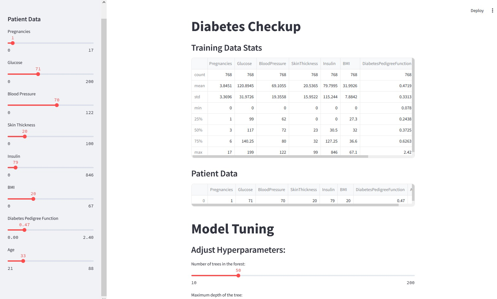

# Diabetes Checkup Application



Watch a demo of the code on [YouTube](https://youtu.be/H1wD3b9vyJw).

This is a Streamlit-based application for predicting diabetes based on patient data. The application includes data visualization, model tuning, and report generation functionalities.

## Features

- **Data Summary:** Displays statistics of the training dataset.
- **Patient Data Input:** Allows users to input their health data through sliders in the sidebar.
- **Model Tuning:** Enables adjustment of hyperparameters for the Random Forest Classifier.
- **Visualizations:** Visualizes patient data against existing data to compare health metrics.
- **Prediction and Reporting:** Predicts diabetes status and provides an accuracy score of the model.
- **Export PDF Report:** Generates a PDF report summarizing the patient's health data.

## Usage

To run the application locally:

1. Clone the repository:
 ```
git clone https://github.com/your_username/diabetes-checkup.git
cd diabetes-checkup
```
2. Install the required dependencies:
 ```
pip install -r requirements.txt
 ```
3. Run the Streamlit application:

 ```
streamlit run app.py
 ```
4. Open your web browser and go to:
 ```
http://localhost:8501
 ```

## Screenshots

### Data Summary and Patient Input


### Model Tuning and Visualizations


### Prediction and PDF Report Export


## About

This application utilizes Streamlit for the frontend, pandas for data handling, scikit-learn for machine learning tasks, and matplotlib/seaborn for data visualization.

## Credits

- Developed by [Reese](https://github.com/404reese)
- Dataset sourced from [Kaggle](https://www.kaggle.com/)
