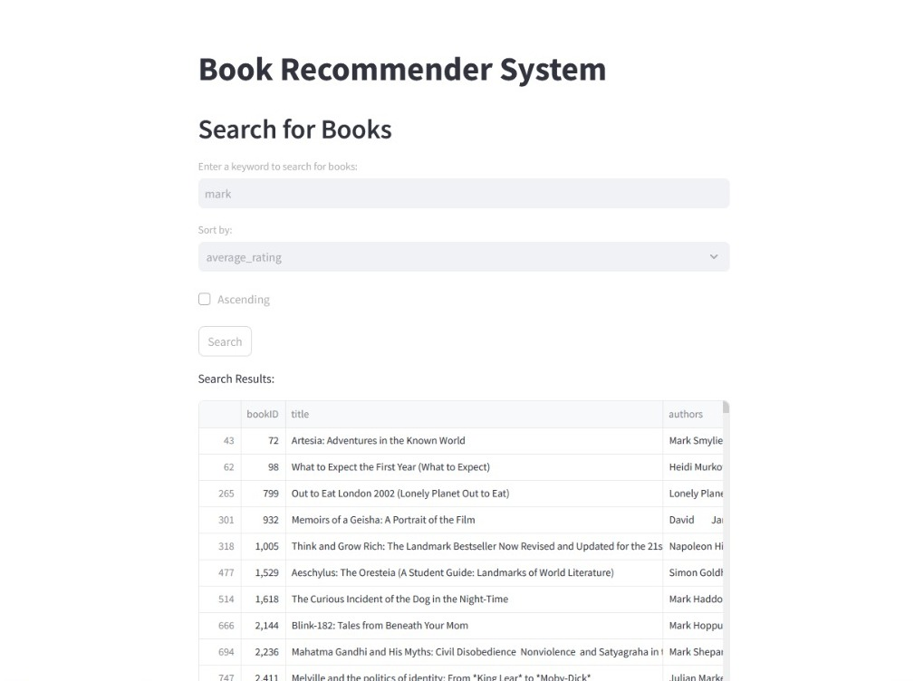

# Book Recommender System



This project is a simple book recommendation system built using Streamlit. It allows users to search for books based on keywords and view top books by average rating.

## Features

- **Search for Books:** Users can enter a keyword to search for books by title, authors, or publisher.
- **Sort and Filter:** Sort search results by average rating, publication date, or number of pages.
- **Top Books:** Displays the top 50 books based on average rating.

## Demo

Watch the demo of the project on [YouTube](https://youtu.be/6plocvpxIz0).

## Usage

To run the application locally:

1. Clone the repository:
 ```
git clone https://github.com/404reese/book-recommender-system.git
cd diabetes-checkup
```
2. Install the required dependencies:
 ```
pip install -r requirements.txt
 ```
3. Run the Streamlit application:

 ```
streamlit run app.py
 ```
4. Open your web browser and go to:
 ```
http://localhost:8501
 ```

## About

This application utilizes Streamlit for the frontend and pandas for data handling. The dataset used is sourced from [GitHub](https://raw.githubusercontent.com/404reese/ML-projects/main/Book%20Recommendation%20System/books-dataset.csv).

## Credits

- Developed by [Reese](https://github.com/404reese)
- Dataset sourced from [Kaggle](https://kaggle.com/)
