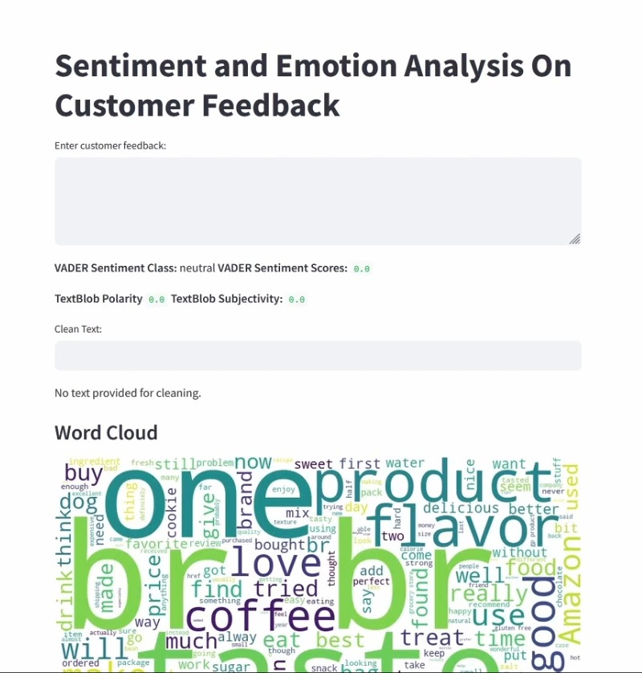

# Sentiment and Emotion Analysis On Customer Feedback



This project performs sentiment and emotion analysis on customer feedback using Streamlit. It utilizes VADER for sentiment analysis, TextBlob for sentiment polarity and subjectivity, NRCLex for emotion analysis, and includes visualizations such as word clouds and histograms.

## Features

- **Sentiment Analysis:** Classifies sentiment using VADER and analyzes sentiment polarity and subjectivity using TextBlob.
- **Emotion Analysis:** Uses NRCLex to identify top emotions and their intensities in customer feedback.
- **Text Cleaning:** Provides functionality to clean input text by removing stopwords, punctuation, and special characters.
- **Word Cloud Visualization:** Generates a word cloud based on customer feedback to visualize frequent words.
- **Export Data:** Allows exporting sentiment analysis results in CSV or Excel format.
- **Interactive Interface:** Users can input their own text for real-time sentiment and emotion analysis.

## Demo

Watch the demo of the project on [YouTube](https://youtu.be/c2Dp0zY4aqg)

## Usage

To run the application locally:

1. Clone the repository:
 ```
git clone https://github.com/404reese/sentiment-emotion-analysis.git
cd diabetes-checkup
```
2. Install the required dependencies:
 ```
pip install -r requirements.txt
 ```
3. Run the Streamlit application:

 ```
streamlit run app.py
 ```
4. Open your web browser and go to:
 ```
http://localhost:8501
 ```

## About

This application utilizes Streamlit for the frontend, pandas for data handling, and various NLP libraries for sentiment and emotion analysis. The dataset used is sourced from [GitHub](https://raw.githubusercontent.com/404reese/ML-projects/main/Sentiment-Analysis/Sentiment.csv).

## Credits

- Developed by [Reese](https://github.com/404reese)
- Dataset sourced from [Kaggle](https://kaggle.com/)
