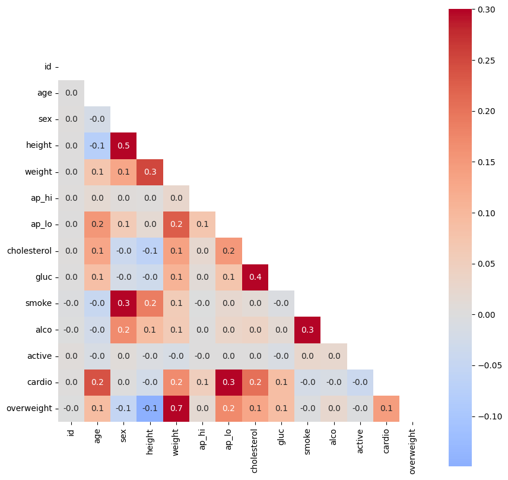
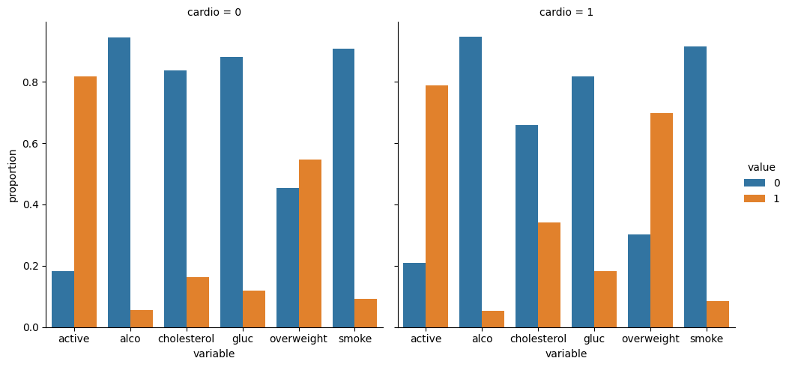

# Medical Examination Data Analysis

This project involves visualizing and making calculations from medical examination data using matplotlib, seaborn, and pandas. The dataset consists of values collected during medical examinations of patients.

## Assignment Overview

The main tasks for this project include:

1. **Data Visualization:**
   - Create visualizations showing the counts of various medical outcomes based on patient characteristics.
   - Generate charts similar to `examples/Figure_1.png` using seaborn's `catplot()`.

2. **Data Manipulation:**
   - Add an `overweight` column based on BMI calculations.
   - Normalize `cholesterol` and `gluc` values.
   - Clean the dataset by filtering out incorrect data points.

3. **Correlation Analysis:**
   - Create a correlation matrix and visualize it using seaborn's `heatmap()`.
   - Mask the upper triangle of the correlation matrix to focus on meaningful correlations.

## Dataset Description

The dataset `medical_examination.csv` contains the following columns:

| Feature                           | Variable Type         | Variable             | Value Type                          |
|-----------------------------------|-----------------------|----------------------|-------------------------------------|
| Age                               | Objective Feature     | age                  | int (days)                          |
| Height                            | Objective Feature     | height               | int (cm)                            |
| Weight                            | Objective Feature     | weight               | float (kg)                          |
| Gender                            | Objective Feature     | gender               | categorical code                    |
| Systolic blood pressure           | Examination Feature   | ap_hi                | int                                 |
| Diastolic blood pressure          | Examination Feature   | ap_lo                | int                                 |
| Cholesterol                       | Examination Feature   | cholesterol          | 1: normal, 2: above normal, 3: well above normal |
| Glucose                           | Examination Feature   | gluc                 | 1: normal, 2: above normal, 3: well above normal |
| Smoking                           | Subjective Feature    | smoke                | binary                              |
| Alcohol intake                    | Subjective Feature    | alco                 | binary                              |
| Physical activity                 | Subjective Feature    | active               | binary                              |
| Presence or absence of cardiovascular disease | Target Variable | cardio               | binary                              |

## File Structure

- `medical_data_visualizer.py`: Python script containing functions to manipulate and visualize the dataset.
- `medical_examination.csv`: Dataset file containing the medical examination data.

## Instructions to Run

To run the project:

1. Ensure Python and the required libraries (matplotlib, seaborn, pandas) are installed.
2. Clone the repository and navigate to the project directory.
3. Run `medical_data_visualizer.py` to execute the analysis and generate visualizations.

## Example Visualizations

### Figure 1: Counts of Medical Outcomes

This figure displays the counts of good and bad outcomes for various medical variables split by patients with and without cardiovascular disease.

### Figure 2: Correlation Matrix

This figure shows the correlation matrix of the dataset, highlighting correlations between different features.

## Project Completion

In this project, we explored the relationship between medical examination data and cardiovascular disease using visualization and data analysis techniques. The `medical_data_visualizer.py` script provides functionality to manipulate, clean, and visualize the dataset as per the assignment requirements.

For detailed implementation, refer to the code in `medical_data_visualizer.py` and explore the dataset `medical_examination.csv`.

## requirements
* seaborn==0.13.2
* pandas==1.5.3