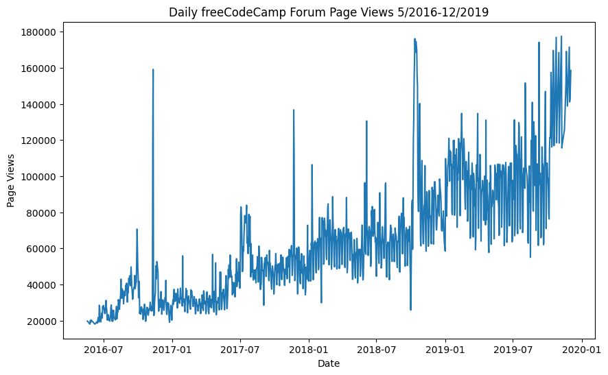
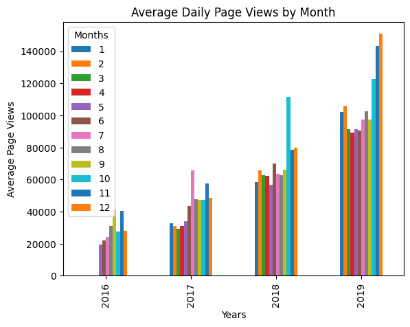
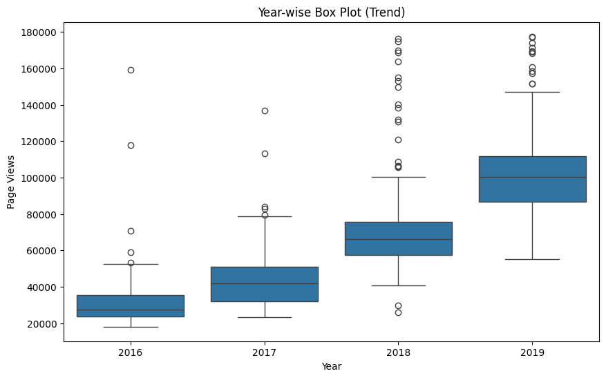

# Visualizing Time Series Data

In this project, we visualize time series data using Pandas, Matplotlib, and Seaborn. The dataset contains the number of page views each day on the freeCodeCamp.org forum from 2016-05-09 to 2019-12-03. The visualizations help understand patterns in visits and identify yearly and monthly growth.

**Note:** Instead of separate files, all code is consolidated into a single Jupyter notebook for simplicity.

## Tasks

1. Use Pandas to import the data from "fcc-forum-pageviews.csv" and set the index to the date column.
2. Clean the data by filtering out days when the page views were in the top 2.5% or bottom 2.5% of the dataset.
3. Implement the following functions to create visualizations:
   - `draw_line_plot`: Draws a line chart of daily page views.
   - `draw_bar_plot`: Draws a bar chart of average daily page views for each month grouped by year.
   - `draw_box_plot`: Draws two adjacent box plots showing yearly and monthly distributions of page views.

## Functions Implemented

- `draw_line_plot`: Draws a line chart showing daily page views from May 2016 to December 2019.
- `draw_bar_plot`: Draws a bar chart showing average daily page views for each month grouped by year.
- `draw_box_plot`: Draws two box plots showing yearly and monthly distributions of page views.

## Example Visualizations

### Figure 1: Daily freeCodeCamp Forum Page Views 5/2016-12/2019

This line chart illustrates the daily page views on the freeCodeCamp.org forum from May 2016 to December 2019.

### Figure 2: Average Daily Page Views per Month

This bar chart displays the average daily page views for each month grouped by year, helping to identify monthly trends.

### Figure 3: Year-wise and Month-wise Box Plots

These box plots show the distribution of page views within each year (Year-wise Box Plot) and within each month across all years (Month-wise Box Plot), highlighting trends and seasonality.

## Running the Notebook

To run the project:

1. Ensure you have Python and the required libraries (Pandas, Matplotlib, Seaborn).
2. Clone the repository and navigate to the directory containing the Jupyter notebook.
3. Open the notebook and execute each cell to import the data, clean it, and generate visualizations.

## Conclusion

This project provides insights into the usage patterns of the freeCodeCamp.org forum over the years, showcasing how to effectively visualize time series data using Python libraries. The consolidated approach in a single notebook makes it easier to understand and reproduce the analysis.

For detailed implementation, refer to the code in the Jupyter notebook.

