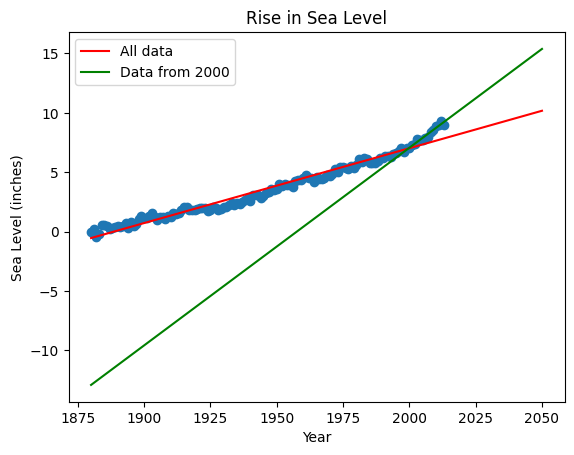

# Analyzing Global Average Sea Level Change

In this project, we analyze a dataset of the global average sea level change since 1880. Using the data, we aim to predict sea level changes through the year 2050.

**Note:** All code and analyses are consolidated into a single Jupyter notebook for simplicity.

## Tasks

1. Use Pandas to import the data from "epa-sea-level.csv".
2. Create a scatter plot using Matplotlib:
   - X-axis: Year
   - Y-axis: CSIRO Adjusted Sea Level
   - Title: Rise in Sea Level
   - X label: Year
   - Y label: Sea Level (inches)
3. Use `linregress` from `scipy.stats` to:
   - Get the slope and y-intercept of the line of best fit for the entire dataset.
   - Plot the line of best fit over the scatter plot, extending it to the year 2050.
4. Plot a new line of best fit using data from year 2000 onwards:
   - Extend this line of best fit to the year 2050 to predict sea level rise if the recent trend continues.

## Functions Implemented

- **Data Import and Visualization:** Loads the sea level data and creates initial scatter plots.
- **Linear Regression:** Calculates slopes and intercepts for trend lines.
- **Prediction:** Extends trend lines to predict sea level rise up to the year 2050.

## Example Visualizations

### Scatter Plot with Trend Lines

This scatter plot visualizes the global average sea level change since 1880, with trend lines predicting sea level rise up to 2050 based on different time periods.

## Running the Notebook

To run the project:

1. Ensure you have Python and the required libraries (Pandas, Matplotlib, SciPy).
2. Clone the repository and navigate to the directory containing the Jupyter notebook.
3. Open the notebook and execute each cell to import the data, perform analyses, and generate visualizations.

## Conclusion

This project provides insights into global sea level changes over time and predicts future trends based on historical data. The consolidated approach in a single notebook facilitates understanding and reproducibility of the analysis.

For detailed implementation, refer to the code in the Jupyter notebook.