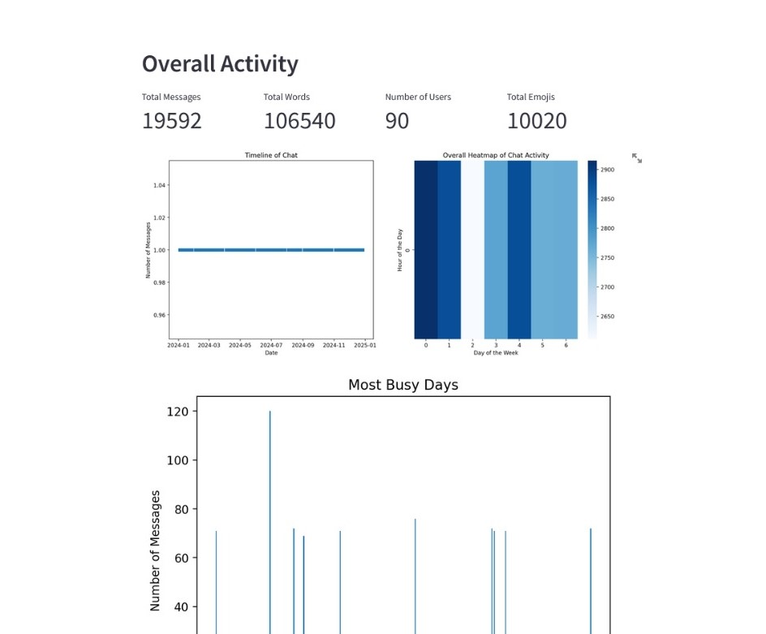

# WhatsApp Analysis App



An interactive Streamlit application for analyzing WhatsApp chat data. The app provides insights into message frequency, word usage, emoji usage, and user engagement metrics. It includes visualizations such as timelines, heatmaps, word clouds, and bar charts to help users understand their WhatsApp chat history.

## Features

- **Message Analysis:** Provides metrics such as total messages, total words, and number of users in the chat.
- **Timeline Visualization:** Plots the timeline of messages over time.
- **Heatmap:** Displays the overall activity heatmap of chat messages by hour and day.
- **Top Engaged Users:** Identifies the most engaged users based on the number of messages sent.
- **Word Cloud:** Generates a word cloud to visualize frequently used words in the chat.
- **Top Used Words:** Displays a table and horizontal bar chart of the most used words.
- **Top Used Emojis:** Shows a table and horizontal bar chart of the most used emojis.

## Demo

Watch the demo of the project on [YouTube](https://youtu.be/L19xRLq9Iac).

## Usage

To run the application locally:

1. Clone the repository:
 ```
git clone https://github.com/404reese/whatsapp-analysis.git
cd diabetes-checkup
```
2. Install the required dependencies:
 ```
pip install -r requirements.txt
 ```
3. Run the Streamlit application:

 ```
streamlit run app.py
 ```
4. Open your web browser and go to:
 ```
http://localhost:8501
```

## About

This application utilizes Streamlit for the frontend, pandas for data handling, and matplotlib, seaborn, wordcloud, and emoji libraries for visualization and analysis. The chat data used in this demo is sourced from [GitHub](https://raw.githubusercontent.com/404reese/ML-projects/main/Whatsapp%20Data%20Analysis/big-WH-data.csv).

## Credits

- Developed by [Reese](https://github.com/404reese)
- Chat data sourced from [Kaggle](https://kaggle.com)
